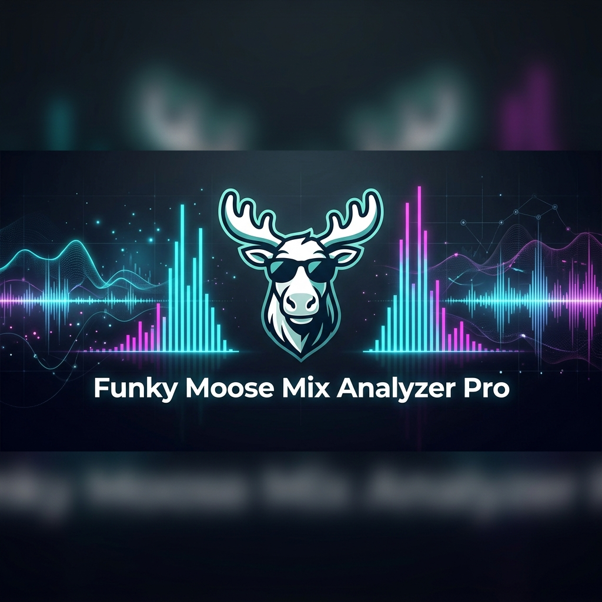
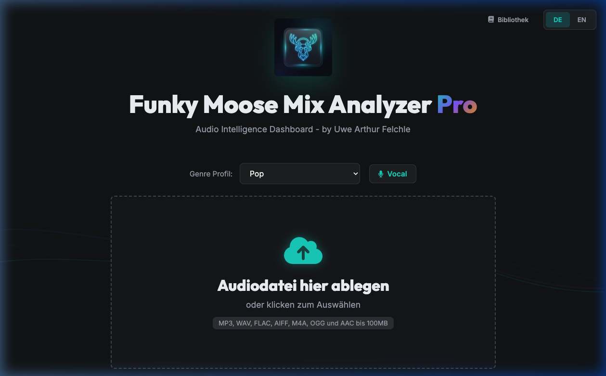
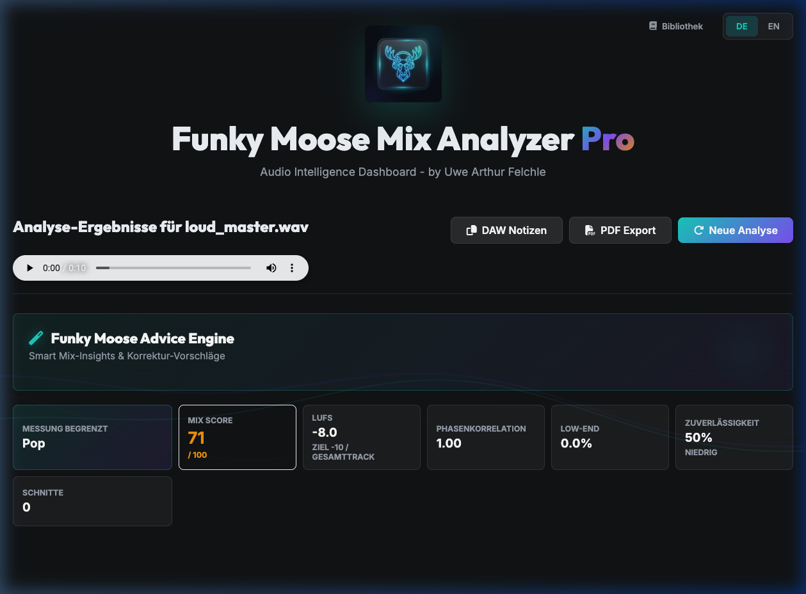

<p align="center">
  
  
  
</p>

# 🦌 Funky Moose Mix Analyzer Pro

[🇩🇪 Deutsche Version](#) | [🇬🇧 English Version](README.md)

**Ein lokaler Mix-Analyzer für Musiker:innen, die schnell verstehen wollen, was ihr Master gerade macht.** 

Kein Ersatz für deine Ohren – aber ein verdammt guter zweiter Blick. Der Funky Moose Mix Analyzer Pro ist ein Werkzeug für das Home-Studio, das deine Audio-Exporte gegen bewährte Genre-Standards prüft. Es liefert dir objektive Metriken zu Lautheit, Frequenzbalance und Phasenlage, ohne deine Tracks in eine Cloud hochladen zu müssen.



---

## ✨ Was der Elch kann

*   **Interaktive FFT-Analyse**: Schau dir dein Frequenzspektrum im Detail an. Inklusive Hover-Werten, M/S-Darstellung und Zielkurven.
*   **Ehrlicher Track-Vergleich (A/B)**: Lade Referenztracks und vergleiche sie direkt mit deinem Mix. Die Differenzkurve zeigt dir sofort, wo du im Vergleich zu deinem Vorbild stehst.
*   **Genre-Referenzkurven**: Über 30 Profile von Techno über Rock bis Podcast helfen dir, die richtige Balance zu finden.
*   **Funky Moose Advice Engine**: Statt leerer AI-Buzzwords gibt es handfeste Tipps basierend auf deinen Messwerten – von "Low-End aufräumen" bis zu Resonanz-Warnungen.



*   **Loudness & Dynamics**: Messung von LUFS (EBU R128), True Peak und Crest-Faktor für einen wettbewerbsfähigen Pegel.
*   **Privacy First**: Deine Musik ist heilig. Alle Analysen laufen 100% lokal auf deinem Rechner.

---

## 🚀 Installation & Start

### Für Musiker:innen & Produzent:innen
Eine macOS-Beta kann lokal gebaut werden. Öffentliche Downloads folgen nach weiteren Tests. Bis dahin kannst du das Tool einfach über das Terminal starten.

### Für Entwickler (und Neugierige)
Stelle sicher, dass **FFmpeg** installiert ist:
*   **macOS**: `brew install ffmpeg`
*   **Windows**: `choco install ffmpeg`

1. Repository klonen:
   ```bash
   git clone https://github.com/blubass/FunkyMooseMixAnalyzerPro.git
   cd FunkyMooseMixAnalyzerPro
   ```

2. Virtuelle Umgebung erstellen (empfohlen):
   ```bash
   python3 -m venv .venv
   source .venv/bin/activate  # macOS/Linux
   # oder: .venv\Scripts\activate  # Windows
   ```

3. Abhängigkeiten installieren & Starten:
   ```bash
   pip install -r requirements.txt
   python app.py
   ```

---

## 🧪 Test Run

Um die mathematische Genauigkeit der Engine zu prüfen, kannst du automatisierte Tests gegen das laufende Backend fahren.

1. Starte die App (`python app.py`).
2. Lege eigene Test-Dateien in `tests/test_files/` ab:
   * `loud_master.wav`
   * `dynamic_track.wav`
   * `problematic_bass.wav`
3. Starte den Runner:
   ```bash
   bash tests/run_tests.sh
   ```

*Hinweis: Testdateien sind nicht im Repository enthalten, um die Größe gering zu halten.*

---

## 🏗️ macOS App bauen

Du kannst das native macOS Bundle (`.app`) und den Installer (`.dmg`) selbst generieren:

1. **Abhängigkeiten**:
   ```bash
   pip install pyinstaller
   ```
2. **App bauen**:
   ```bash
   bash scripts/build_macos_app.sh
   ```
3. **DMG erstellen**:
   ```bash
   bash scripts/make_dmg.sh
   ```

---

## 🛠️ Plugin

Das JUCE-Plugin gibt es als VST3, AU und Standalone. Standardmäßig bleibt es ein transparenter Analyzer. Wenn **Auto Master** bewusst aktiviert wird, arbeitet ein konservativer Master-Assistent mit Genre-Ziel-LUFS, -1.0 dBTP Ausgangsschutz, leichter Tonbalance-Korrektur, Stereo-Sicherheitslogik, adaptiver Glue-Kompression, Loudness-Match-A/B-Abhörmodus, Equal-Loudness-A/B-Check, Safety-Governor-Empfehlung, Auto-Master-Release-Score und Stärke-Regler.

---

## 🛠 Technik hinter dem Geweih

*   **Backend**: Python & Flask
*   **Audio-Engine**: NumPy & FFmpeg (Loudness & Decoding)
*   **Frontend**: PyWebView & Chart.js für interaktive Visualisierungen.
*   **Datenbank**: SQLite für deine lokale Analyse-Historie.

---

## 🔬 Für die Nerds (Mathematik)
Der Analyzer nutzt Fast Fourier Transformation (FFT) mit Hann-Windowing für präzise Frequenzauflösung. Die Onset-Detection basiert auf Spectral Flux mit einem adaptiven Noise-Floor, um auch bei stark limitiertem Material ("Sausage-Waveform") präzise Transienten zu finden.

---

## 📄 Lizenz
Dieses Projekt steht unter der **MIT-Lizenz** – nutze es, verbessere es, mach Musik damit.

*Entwickelt mit Herz & Elchblut von Uwe Arthur Felchle*
